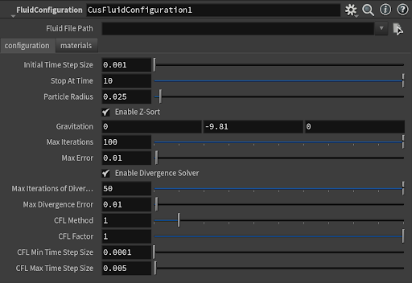
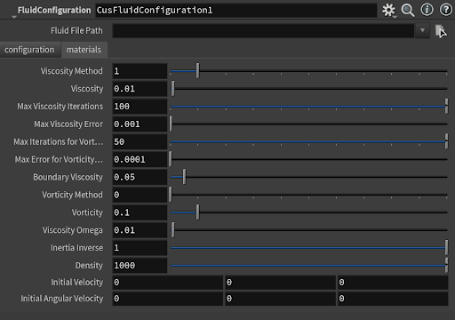
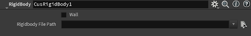
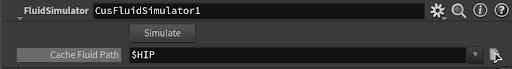
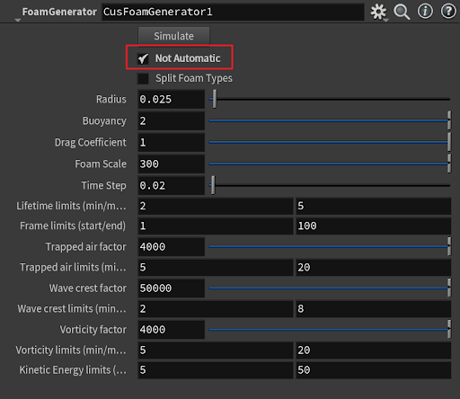
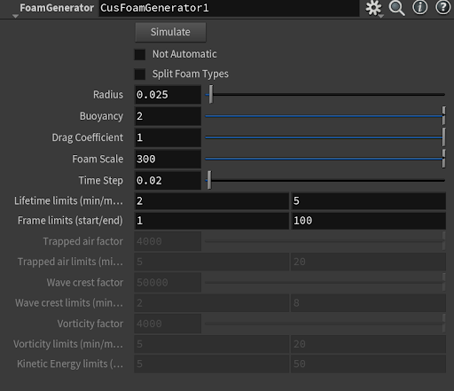
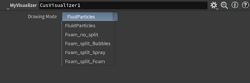
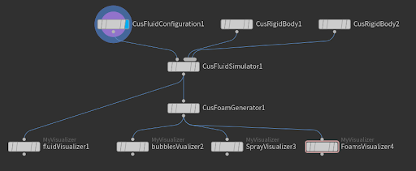

### Start

To use our authoring tool, the user should first **create a geometry node** in Houdini and double click into the subnet work since our custom nodes are SOP nodes and must be placed inside a geometry network. 

### Fluid Configuration

Then the user should place a Fluid Configuration Node by searching **“FluidConfiguration”**, and set the simulation parameters. The geometry file for the shape of the fluid model should be in obj file format. This parameter must be set in order to run the simulation.

In the **“Fluid File Path”** parameter, the user should choose an obj file as the shape of the fluid model.
There are two tabs for the fluid configuration node: **configuration tab** and **material tab**. The configuration tab has parameters that are related to the SPH simulation settings such as timestep and SPH solver types. 

| |
|:--:|
| *Parameters for General Configuration Tab* |

The material tab focuses on the physical properties of the fluid such as viscosity and vorticity.

| |
|:--:|
| *Parameters for Material Configuration Tab* |

### RigidBody

Search for the **“RigidBody”** and add a Rigid Body node. The user should **at least set a Rigid Body node as the bounding box** of the simulation scene. If the rigid body is to be set as a bounding box, the user must check the **“IsWall”** flag so the fluid will collide on the inside face of the rigid body geometry. 

| |
|:--:|
| *Parameters for Rigid Body Tab* |

### Fluid Simulator

Set a Simulation node by searching “FluidSimulator”. Then link the output of the Fluid Configuration to the first input of the Simulation node, and RigidBody nodes to the second input of the Simulation node.

In the simulation node, the user can set a folder for the cached fluid particle data. If not set, the folder will be the directory where the houdini file is stored. To simulate with the configuration, the user should click the “simulation” button. 

| |
|:--:|
| *Parameters for Simulator Tab* |

Set a Visualizer node by searching “MyVisualizer”. Link the output of the Simulator Node to visualize the particles as points in the scene.

### Foam Generation

Set a Foam Generator node by searching “FoamGenerator”. Set parameters for the foam simulation and whether split types for foams. Link the simulation node’s output to the input of this node and click the “simulate” button. 

Not Automatic: check this box so the users can set parameters that affect foam simulation.

Split foam types: check this box to generate three different foam types.

| |  |
|:--:|:--:|
| *Parameters for Foam Tab without Auto Type Selections* | *Parameters for Foam Tab with Auto Type Selections* | 

### Visualizer

Set a Visualizer node by searching “MyVisualizer”. Link the output of the Foam Generator Node to visualize the particles as points in the scene. If the user chooses to use split types for foams, they should choose which type of foam to visualize by selecting from a drop-down menu.

| |
|:--:|
| *Parameters for Visualizer Tab* |

The users then can use other default nodes in Houdini to apply shaders and rendering techniques to the particle points.

### Node Workflow

A typical houdini workflow for our project is shown below:

| |
|:--:|
| *Houdini Nodes Workflow* |

